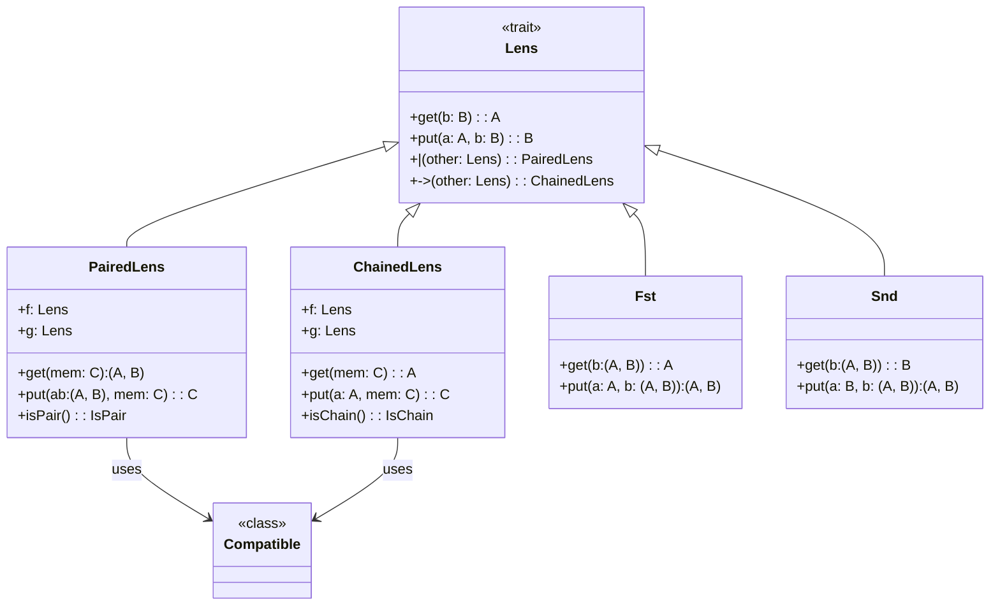
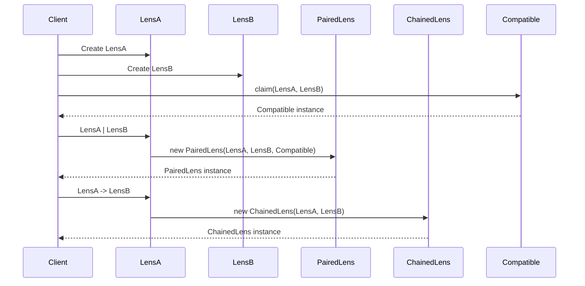

# Haskell Lens Implementation

> [!WARNING]
> This is a toy implementation for educational purposes only, I am learning Haskell. 
> This code is not production-ready and for sure contains bugs.

## Abstract

Toy implementation of a lens system in Haskell, providing a flexible way to access and modify nested data structures. 

## Motivation

1. Provide a type-safe mechanism for accessing and modifying nested data.
2. Ensure lens compatibility and composition at the type level.
3. Demonstrate advanced Haskell type system features in a practical context.

## Design

### Lens Class



### Sequence




## Implementation

### 1. Core Lens Type

```haskell
data Lens a b where
  Lens :: { get :: b -> a
          , put :: a -> b -> b
          } -> Lens a b
```

The `Lens` type is the foundation of our system. It represents a **bidirectional accessor** for a value of *type `a`* within a structure of *type `b`*. 

The `get` function extracts the value, while the `put` function updates it.

### 2. Lens Compatibility

```haskell
type family Compatible (f :: Type) (g :: Type) :: Bool

data IsCompatible f g where
  Compatible :: Compatible f g ~ 'True => IsCompatible f g
```

We use a type family `Compatible` to represent lens compatibility at the type level. The `IsCompatible` GADT serves as a proof of compatibility, which can be used as a constraint in other types and functions.

### 3. Paired and Chained Lenses

```haskell
data PairedLens a b c where
  PairedLens :: (Compatible f g ~ 'True) =>
                { fst :: Lens a c
                , snd :: Lens b c
                } -> PairedLens a b c

data ChainedLens a b c where
  ChainedLens :: { outer :: Lens b c
                 , inner :: Lens a b
                 } -> ChainedLens a b c
```

These types represent composed lenses. `PairedLens` combines two compatible lenses focusing on different parts of the same structure, while `ChainedLens` composes two lenses sequentially.

### 4. Composition Operators

```haskell
(|) :: (Compatible f g ~ 'True) => Lens a c -> Lens b c -> PairedLens a b c
f | g = PairedLens f g

(-->) :: Lens b c -> Lens a b -> ChainedLens a b c
f --> g = ChainedLens f g
```

These operators provide a convenient syntax for composing lenses. The `|` operator creates a paired lens, while `-->` creates a chained lens.

### 5. Implementation Functions

```haskell
getPaired :: PairedLens a b c -> c -> (a, b)
putPaired :: PairedLens a b c -> (a, b) -> c -> c

getChained :: ChainedLens a b c -> c -> a
putChained :: ChainedLens a b c -> a -> c -> c
```

These functions implement the `get` and `put` operations for `PairedLens` and `ChainedLens`, respectively.

### 6. Compatibility Claims

```haskell
class ClaimCompatible f g where
  claimCompatible :: IsCompatible f g

instance ClaimCompatible (Lens Int String) (Lens Bool String) where
  claimCompatible = Compatible
```

The `ClaimCompatible` type class allows users to declare compatibility between specific lens types. This is crucial for enabling the composition of custom lenses.

### 7. Helper Functions

```haskell
useLens :: Lens a b -> (b -> a, a -> b -> b)
usePairedLens :: PairedLens a b c -> (c -> (a, b), (a, b) -> c -> c)
useChainedLens :: ChainedLens a b c -> (c -> a, a -> c -> c)
```

These functions provide a convenient way to use different types of lenses, returning tuples of getter and setter functions.

## Usage Example

> [!NOTE] 
> Demonstrates how to create simple lenses, compose them into more complex lenses, and use them to update nested data structures.


```haskell
type Person = (String, Int)
type Address = (String, String)
type ContactInfo = (Person, Address)

nameLens :: Lens String Person
nameLens = Lens { get = fst, put = \name (_, age) -> (name, age) }

ageLens :: Lens Int Person
ageLens = Lens { get = snd, put = \age (name, _) -> (name, age) }

-- Creating a paired lens
personLens :: PairedLens String Int Person
personLens = nameLens | ageLens

-- Creating a chained lens
nameInContactInfo :: ChainedLens String Person ContactInfo
nameInContactInfo = fstLens --> nameLens

-- Using a lens
updateName :: String -> ContactInfo -> ContactInfo
updateName newName = snd (useChainedLens nameInContactInfo) newName
```


## License

UPL-1.0

